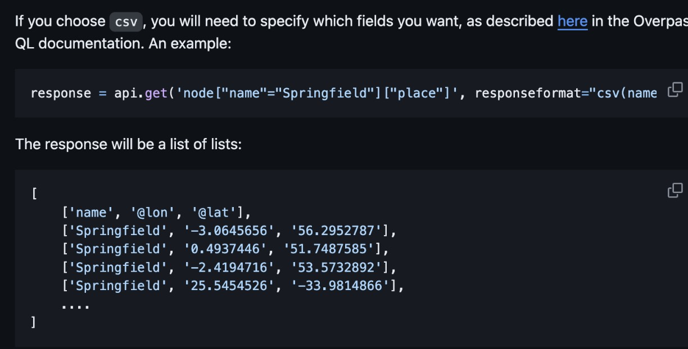

# Team1 Proposal
## Team Name:  
PetPal
## Team Members: 
Chenguang Liu, Dao Zheng ChangDao, Zheng Chang, Favour Chiemerie Madubuko, Zhequn Wu

## Summary
Our idea is to build an application that can leverage technology to improve a pet owner’s experience. There are 2 main facets to our application. Firstly, we want to create a platform where pet owners can rate points of interest based on their experiences of bringing their pets there. Next, we want to create a service that helps pet owners to plan a day out with their pets.

The first facet involves accepting coordinates from the user and returning them useful information about nearby points of interest (POI). This information includes reviews on the location, an interest score on the location and pets that have visited the POI. Additionally, a user can also create a profile to store favorite locations. 

To improve the user experience, we will also develop a service that helps pet owners plan a day out with their pets. This involves gathering nearby POIs with high interest scores and querying LLM models, such as GPT or Gemini, for a detailed plan for the day. This plan can be stored in the database and retrieved when other users make a similar request. 

## External API
[Current geolocation](https://www.tutorialspoint.com/how-to-get-geolocation-in-python)
[Overpass API](https://wiki.openstreetmap.org/wiki/Overpass_API): [API Wrapper](https://github.com/mvexel/overpass-api-python-wrapper) (if it’s not working, try [Google Places API](https://developers.google.com/maps/documentation/places/web-service/))

[OpenAI API/Chat](https://platform.openai.com/docs/api-reference/chat) ->  get a detailed plan
[dog attributes](https://dogapi.dog/docs/api-v2) 